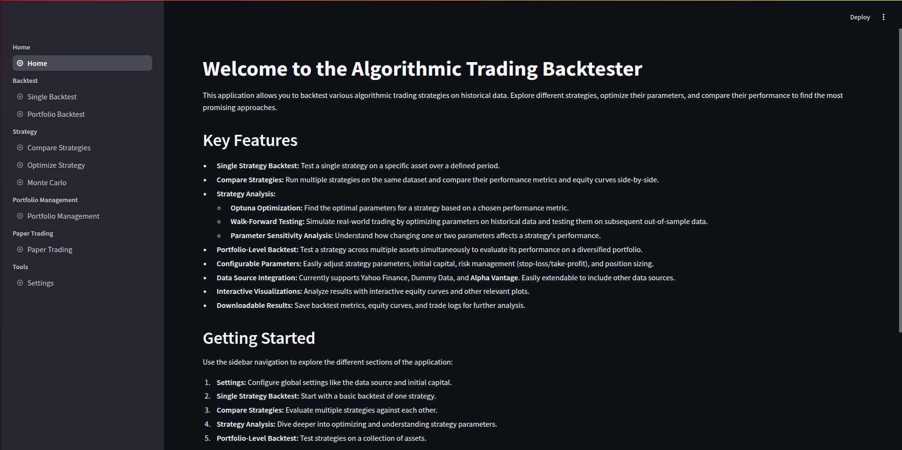
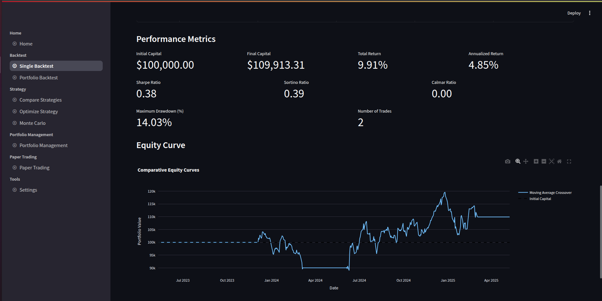
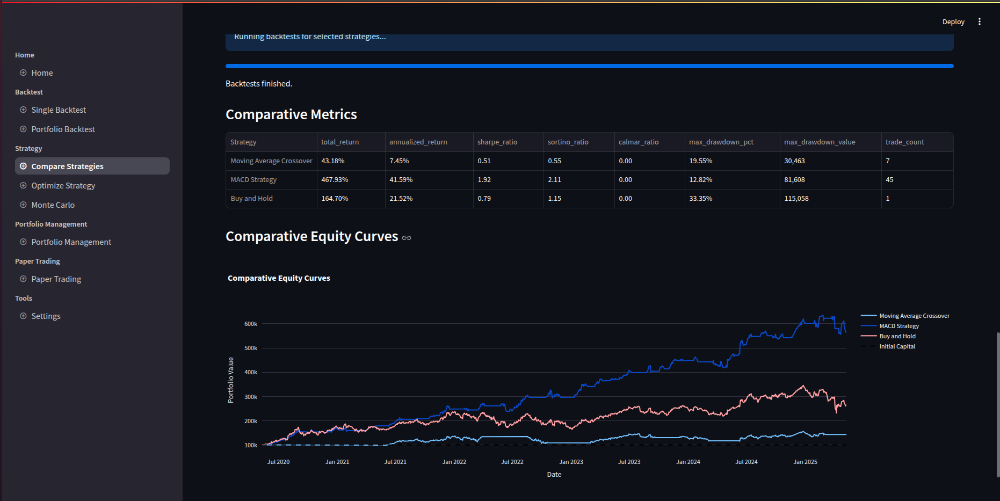

# Trading Strategy Backtester and Paper Trading Simulator

[](https://www.python.org/)
[](https://streamlit.io/)
[](LICENSE)

A powerful Streamlit-based application for backtesting trading strategies on historical data and simulating paper trading. This tool supports multiple data sources and various trading strategies, making it ideal for both beginners and experienced traders.


*Main dashboard showing key metrics and controls*

## 🌟 Features

- **Multiple Data Sources**
  - Yahoo Finance
  - Alpaca
  - Zerodha
  - Dummy data for testing

- **Trading Strategies**
  - Moving Average Crossover
  - RSI (Relative Strength Index)
  - MACD (Moving Average Convergence Divergence)
  - Momentum
  - Breakout
  - Buy and Hold

- **Advanced Features**
  - Single asset backtesting
  - Portfolio backtesting with initial allocation
  - Monte Carlo simulation
  - Paper trading simulation
  - Configurable parameters
  - Interactive visualizations
  - Results export (CSV/JSON)


## 🚀 Installation

1. Clone the repository:
```bash
git clone https://github.com/yourusername/tradingbot_gemini.git
cd tradingbot_gemini
```

2. Create and activate a virtual environment:
```bash
# Create virtual environment
python -m venv venv

# Activate on Linux/macOS
source venv/bin/activate

# Activate on Windows
.\venv\Scripts\activate
```

3. Install dependencies:
```bash
pip install -r requirements.txt
```

4. Configure API Keys (optional):
Create `.streamlit/secrets.toml` in the project root:
```toml
# For Alpaca
ALPACA_API_KEY = "your_api_key"
ALPACA_SECRET_KEY = "your_secret_key"

# For Zerodha
ZERODHA_API_KEY = "your_api_key"
ZERODHA_ACCESS_TOKEN = "your_access_token"
```

## 💻 Usage

1. Start the application:
```bash
streamlit run app.py
```

2. Navigate through the application:
   - **Backtest**: Single-asset strategy testing
   - **Portfolio Backtest**: Multi-asset portfolio testing
   - **Monte Carlo**: Strategy robustness simulation
   - **Paper Trading**: Live trading simulation
   - **Settings**: Configure data sources and API keys


*Example backtest results with performance metrics and charts*


*Portfolio analysis dashboard showing asset allocation and performance*

## 📁 Project Structure

```
tradingbot_gemini/
├── app.py                 # Main application entry point
├── requirements.txt       # Project dependencies
├── .streamlit/           # Streamlit configuration
│   └── secrets.toml      # API keys (not tracked in git)
├── data_sources/         # Data provider implementations
├── strategies/           # Trading strategy implementations
├── backtester/           # Backtesting engine
├── utils/               # Utility functions
└── pages/              # Streamlit pages
```

## 🤝 Contributing

Contributions are welcome! Please feel free to submit a Pull Request. For major changes, please open an issue first to discuss what you would like to change.

1. Fork the repository
2. Create your feature branch (`git checkout -b feature/AmazingFeature`)
3. Commit your changes (`git commit -m 'Add some AmazingFeature'`)
4. Push to the branch (`git push origin feature/AmazingFeature`)
5. Open a Pull Request

## 📝 License

This project is licensed under the MIT License - see the [LICENSE](LICENSE) file for details.

## ⚠️ Disclaimer

This software is for educational purposes only. Do not risk money which you are afraid to lose. USE THE SOFTWARE AT YOUR OWN RISK. THE AUTHORS AND ALL AFFILIATES ASSUME NO RESPONSIBILITY FOR YOUR TRADING RESULTS.